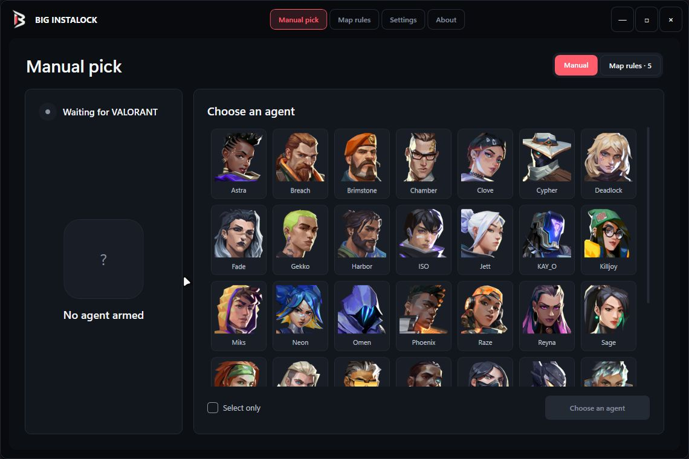

# Big InstaLock

Windows desktop utility for manual VALORANT agent picks and automatic map rules.

> [!WARNING]
> Big InstaLock is provided for educational and research purposes only. Use it at your own risk. The project is not affiliated with or endorsed by Riot Games, and its authors are not responsible for account restrictions, data loss, service interruptions or any other consequences of its use.



## Features

- Manual agent selection with instant lock or select-only mode.
- One automatic agent rule per map.
- Manual picks take priority over map rules.
- Local settings, logs and agent-image cache.
- Movable, resizable WPF interface.

## Usage

### Manual pick

1. Open **Manual pick**.
2. Select an agent.
3. Choose **Select only** if needed.
4. Arm the pick.

### Map rules

1. Open **Map rules**.
2. Select a map, agent and action.
3. Save the rule.
4. Keep automation enabled.

## Build

Requirements:

- Windows 10 or Windows 11
- .NET 8 SDK

```powershell
dotnet restore BigInstalock.csproj
dotnet build BigInstalock.csproj -c Release
```

The executable is generated in `bin\Release\net8.0-windows\`.

## Local data

Settings and cached data are stored in `%LocalAppData%\BigInstalock`.

## Credits

- [Berkwe / Valorant-Instalocker](https://github.com/Berkwe/Valorant-Instalocker)

## Disclaimer

VALORANT and Riot Games are trademarks of Riot Games, Inc. Review Riot Games' current terms and policies before using third-party tools.
