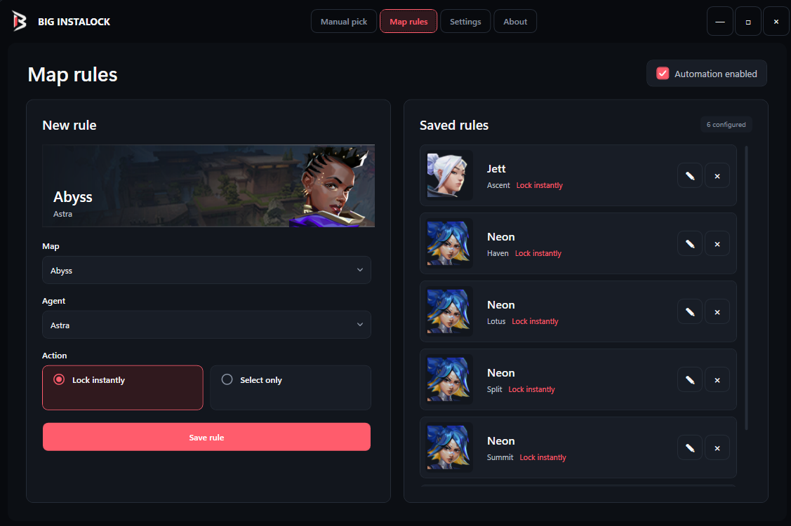

# Big InstaLock


> [!CAUTION]
> **Account risk:** Riot's [Terms of Service](https://www.riotgames.com/en/terms-of-service?tab=t.0) prohibit unauthorized third-party programs, including scripts, bots and automation programs, that interact with Riot Services. Big InstaLock automates agent selection by connecting to the VALORANT client, so using it may put your Riot account at risk. Riot may apply temporary or permanent suspensions, account termination, hardware bans, matchmaking restrictions or other penalties. There is no guarantee that an instalock tool is authorized or safe to use.
>
> Big InstaLock is provided for educational and research purposes only. Use it at your own risk. The project is not affiliated with or endorsed by Riot Games, and its authors are not responsible for account restrictions, data loss, service interruptions or any other consequences of its use. Review Riot's current policies before running it.

> [!NOTE]
> In August 2026, [Dotesports reported](https://dotesports.com/valorant/news/riot-shuts-down-valorant-agent-instalock-app-in-crushing-blow-to-jett-mains-everywhere) that Riot sent a cease-and-desist to an instalock companion app. This report is not an official Riot policy notice, but it reinforces the account-risk warning above.



## Download

[Download the latest Windows x64 release](https://github.com/RealBigJ/BigInstaLock/releases/latest). The build is self-contained and does not require a separate .NET installation.

## Features

- Manual agent selection with instant lock or select-only mode.
- One automatic agent rule per map.

## Build

Requirements:

- Windows 10 or Windows 11
- .NET 8 SDK

```powershell
dotnet restore BigInstalock.csproj
dotnet build BigInstalock.csproj -c Release
```

The executable is generated in `bin\Release\net8.0-windows\`.

## Local data

Settings and cached data are stored in `%LocalAppData%\BigInstalock`.

## Credits

- [Berkwe / Valorant-Instalocker](https://github.com/Berkwe/Valorant-Instalocker)

## Disclaimer

VALORANT and Riot Games are trademarks of Riot Games, Inc. Review Riot Games' current terms and policies before using third-party tools.
